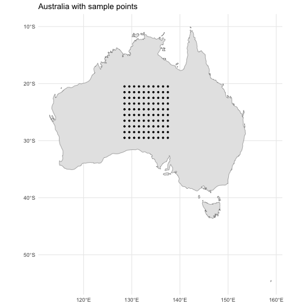

<!-- README.md is generated from README.Rmd. Please edit that file -->

# envfetch <a href="https://github.com/jakemanger/envfetch"></a>

<!-- badges: start -->
<!-- badges: end -->

Your trusty companion to fetch, extract and summarise environmental data
across time and space using gps coordinates or `sf` polygons.

## Installation

You can install the development version of envfetch like so:

``` r
remotes::install_github('jakemanger/envfetch')
```

To enable Google Earth Engine support using the `extract_gee` function,
follow the below instructions:

``` r
library(rgee)

ee_install(py_env = 'rgee')

ee_Initialise()
```

and follow the prompts (saying `Y` when prompted).

Note, these instructions are from the `rgee` page
[here](https://cran.r-project.org/web/packages/rgee/vignettes/rgee01.html).
See this page if you run into problems.

## Example

### 1. Setup table of data with `throw`

Use of envfetch starts with a table: a `dataframe`, `tibble` or `sf`
object.

To begin, we need to create a data table containing a grid of points
over Australia for a range of times.

For most applications, you will have your own dataset. If you have your
own data, load that in as a variable called `d`.

However, for this example, we can generate this using the `throw`
function.

``` r
library(envfetch)

d <- throw(
  offset=c(115, -40),
  cellsize=3,
  n=10,
  time_interval=lubridate::interval(start='2017-01-01', end='2017-01-02'),
)
```

The data set should look like this:

``` r
summary(d)
#>             time_column                  geometry  
#>  Intervals        :100          POINT        :100  
#>  Earliest endpoint:2017-01-01   epsg:4326    :  0  
#>  Latest endpoint  :2017-01-02   +proj=long...:  0  
#>  Time zone        :UTC
```

And can be visualized using the plot function:

``` r
plot(d, axes=TRUE)
```



Each data point in the table has a `sf::geometry` object along with a
`datetime` (a `lubridate::interval` or a date string). Ensure data used
with the envfetch package matches this format.

This `geometry` may be a point or a polygon. You may also just use plain
old `x` and `y` coordinates as separate columns.

Each individual data point will use the `datetime` object to decide what
time range to extract and summarise data in. `datetime` can be a time
range (`lubridate::interval`), a single date (e.g. `"20220101"`) or
datetime `"2010-08-03 00:50:50"`.

### 2. Extract from your data sources with `fetch`

**`fetch`**:

-   passes your data through your supplied extraction functions,
-   caches progress, so that if your function crashes somewhere, you can
    continue where you left off and
-   allows you to repeat sampling across different times (see section 3,
    below).

You can supply any data extraction function to `fetch`, but some useful
built-in data extraction functions are provided:

| Function name        | Description                                                                                                                        |
|----------------------|------------------------------------------------------------------------------------------------------------------------------------|
| `extract_over_time`  | Extract and summarise raster data over multiple time periods for each row in your dataset.                                         |
| `extract_over_space` | Extract and summarise raster data over space for each row in your dataset.                                                         |
| `extract_gee`        | Use Google Earth Engine to extract your chosen image collection bands and summarise this information for each row in your dataset. |
| `get_daynight_times` | Calculates the time since sunrise, time since sunset and day and night hours for each row in your dataset.                         |

In this example, we will use:

-   `extract_over_time` to extract from a large pre-downloaded NetCDF
    file

-   `extract_gee` to extract NDVI data from the MODIS MOD13Q1 dataset on
    Google Earth Engine

To fetch the data, use the **`fetch`** function and supply it with the
extraction functions you would like to use. You can supply your own
custom function here, but ensure you use the anonymous function syntax
so you can specify custom arguments. That is, if following `purrr`
formula syntax: `~your_function(.x, custom_arg='arg_value')` or if
following base R,
`function(x) your_function(x, custom_arg='arg_value')`). Note, `.x` in
the below example is your data set, `d`.

``` r
extracted <- d |>
  fetch(
    ~extract_over_time(.x, r = '/path/to/netcdf.nc'),
    ~extract_gee(
       .x,
       collection_name='MODIS/061/MOD13Q1',
       bands=c('NDVI', 'DetailedQA'),
       time_buffer=16,
     )
  )
```

### 3. Obtain data for repeated time intervals

In certain applications, you may need to obtain environmental data from
repeated previous time periods. For example, we can extract data from
the past six months relative to the time (start time if an interval is
provided) of each data point, with an average calculated for each
two-week block, using the **`.time_rep`** variable.

``` r
rep_extracted <- d |>
  fetch(
    ~extract_over_time(.x, r = '/path/to/netcdf.nc'),
    ~extract_gee(
       .x,
       collection_name='MODIS/061/MOD13Q1',
       bands=c('NDVI', 'DetailedQA'),
       time_buffer=16,
     ),
    .time_rep=time_rep(interval=lubridate::days(14), n_start=-12),
  )
```
