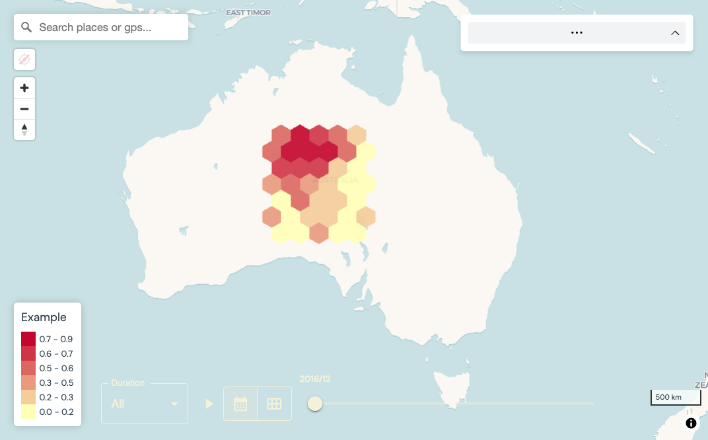

<!-- README.md is generated from README.Rmd. Please edit that file -->


# envfetch <a href="https://github.com/jakemanger/envfetch"></a>

<!-- badges: start -->

[](https://github.com/jakemanger/envfetch/actions/workflows/R-CMD-check.yaml)
<!-- badges: end -->

Your trusty companion to fetch, extract and summarise environmental data over space (with `sf` points or polygons) and time (with a `lubridate` time `interval`, a single date or datetime).

## Installation

You can install the development version of envfetch like so:

``` r
remotes::install_github('jakemanger/envfetch')
```

To enable Google Earth Engine support, follow the below instructions:

``` r
library(rgee)

ee_install(py_env = 'rgee')

ee_Initialize()
```

and follow the prompts (saying `Y` when prompted).

Note, these instructions are from the `rgee` page, 
[here](https://github.com/r-spatial/rgee#installation). See this page if you run
into problems. You may need to set the specific python environment used by 
`rgee` with `reticulate::use_python("path/in/ee_install/to/r-miniconda/envs/rgee/python.exe")`
replacing `path/in/ee_install/to/r-miniconda/envs/rgee/python.exe` with the path 
of the installation listed by `ee_install()`.

## Example

### 1. Setup `sf` collection

Use of envfetch starts with an `sf` collection with a time column. For this example, we will use the `throw` function to create an `sf` collection containing a grid of points over Australia for a range of times. If you have your own data, load that in as a variable called `d` to continue with the example.


``` r
library(envfetch)

d <- throw(
  offset=c(128, -30),
  cellsize=1,
  n=10,
  time_interval=lubridate::interval(start='2017-01-01', end='2017-01-02'),
)
```

The data set should look like the following:


``` r
summary(d)
#>             time_column                  geometry  
#>  Intervals        :100          POINT        :100  
#>  Earliest endpoint:2017-01-01   epsg:4326    :  0  
#>  Latest endpoint  :2017-01-02   +proj=long...:  0  
#>  Time zone        :UTC
```

Each row of the `sf` collection should have an `sf::geometry` along with a `datetime`. The `geometry` may be a point or a polygon. The `datetime` may be a time interval (`lubridate::interval`), a date (e.g. `"20220101"`) or a datetime `"2010-08-03 00:50:50"`. Ensure data used with the envfetch package matches this format.

We can visualise our input data with a plot:


``` r
library(ggplot2)
library(rnaturalearth)
library(rnaturalearthdata)
#> 
#> Attaching package: 'rnaturalearthdata'
#> The following object is masked from 'package:rnaturalearth':
#> 
#>     countries110

# load map of australia for reference
world <- ne_countries(scale = "medium", returnclass = "sf")
australia <- subset(world, admin == "Australia")

ggplot(data = australia) +
  geom_sf() +
  geom_sf(data = d, size = 1, show.legend = "point") +
  ggtitle("Australia with sample points") +
  theme_minimal()
```

<div class="figure">

<p class="caption">plot of chunk unnamed-chunk-3</p>
</div>


### 2. Extract from local rasters or google earth engine with `envfetch`

**`envfetch`**:

-   extracts and summarises data over space (within each `sf` geometry) and time 
    (at each time or within each time range) of your input,
-   provides a simple function to extract from local files or google earth engine (at fast speeds, see our [comparison with other methods](./docs/articles/comparison-with-other-extraction-methods.html)),
-   ensures you don't overuse memory on your machine or google earth engine,
-   caches progress, so you don't have to re-extract the same thing twice and
-   allows you to repeat sampling over different times (see section 3, below).


To fetch the data, supply `envfetch` with your data source. Here, you can extract
from a local netcdf data set. To extract your own raster file, replace
`example_nc_path` with the path of your local raster file, such as `'/path/to/netcdf.nc'`.


``` r
example_nc_path <- system.file("extdata", "example.nc", package = "envfetch")
extracted <- envfetch(x = d, r = example_nc_path)
#> ── 🥏 🐕 Fetching your data ────────────────────────────────────────────────────────────────────────────────
#> → Parsing time column
#> ℹ Running ~extract_over_time(x = .x, r = r[[i]], temporal_fun = temporal_fun[[i]], spatial_fun = spatial_fun[[i]], ...)
#> → Loading raster at path/to/envfetch/inst/extdata/example.nc
#> → Finding relevant time slices
#> → Extracting data...
#> → 626080 Kbs of RAM is required for extraction and 2114265600 Kbs of RAM is available
#> → Completed extraction
#> → Summarising extracted data over specified times
#> → Detected a vectorised row summarisation function. Using optimised summarisation approach with multiple rows as inputs.
#> ✔ 🐶 Completed ~extract_over_time(x = .x, r = r[[i]], temporal_fun = temporal_fun[[i]], spatial_fun = spatial_fun[[i]], ...)
#> 
#> ── 🐩 Fetched ──────────────────────────────────────────────────────────────────────────────────────────────

# visualise with spacetimeview
library(spacetimeview)
spacetimeview(extracted)
```



or from a data set hosted on google earth engine.


``` r
extracted <- envfetch(x = d, r = 'MODIS/061/MOD13Q1')
#> ── rgee 1.1.5 ─────────────────────────────────────────────────────────────────── earthengine-api 0.1.323 ── 
#>  ✔ user: not_defined
#>  ✔ Initializing Google Earth Engine:  DONE!
#>  ✔ Earth Engine account: users/dungbeetlelab 
#> ──────────────────────────────────────────────────────────────────────────────────────────────────────────── 
#> 
#> ── 🥏 🐕 Fetching your data ────────────────────────────────────────────────────────────────────────────────
#> → Parsing time column
#> ℹ Running ~extract_gee(x = .x, collection_name = r[[i]], bands = bands[[i]], temporal_fun = temporal_fun[[i]], ee_reducer_fun = spatial_fun[[i]], initialise_gee = FALSE, ...)
#> Number of features: 100                                                                                   
#> → Summarising extracted data over specified times
#> ✔ 🐶 Completed ~extract_gee(x = .x, collection_name = r[[i]], bands = bands[[i]], temporal_fun = temporal_fun[[i]], ee_reducer_fun = spatial_fun[[i]], initialise_gee = FALSE, ...)
#> 
#> ── 🐩 Fetched ──────────────────────────────────────────────────────────────────────────────────────────────
```

If you want to extract from multiple data sets at once, specify multiple items
with a list. As we've already calculated these, they are loaded from the cache
instantly:


``` r
extracted <- envfetch(
  x = d, 
  r = list(
    example_nc_path,
    'MODIS/061/MOD13Q1'
  )
)
#> ── rgee 1.1.5 ─────────────────────────────────────────────────────────────────── earthengine-api 0.1.323 ── 
#>  ✔ user: not_defined
#>  ✔ Initializing Google Earth Engine:  DONE!
#>  ✔ Earth Engine account: users/dungbeetlelab 
#> ──────────────────────────────────────────────────────────────────────────────────────────────────────────── 
#> 
#> ── 🥏 🐕 Fetching your data ────────────────────────────────────────────────────────────────────────────────
#> → Parsing time column
#> ✔ 🕳️🦴 Dug up cached result of ~extract_over_time(x = .x, r = r[[i]], temporal_fun = temporal_fun[[i]], spatial_fun = spatial_fun[[i]], ...)
#> ✔ 🕳️🦴 Dug up cached result of ~extract_gee(x = .x, collection_name = r[[i]], bands = bands[[i]], temporal_fun = temporal_fun[[i]], ee_reducer_fun = spatial_fun[[i]], initialise_gee = FALSE, ...)
#>
#> ── 🐩 Fetched ──────────────────────────────────────────────────────────────────────────────────────────────
```

If you want to change the default `mean` summarisation behaviour (e.g., calculate the
`mean` for one raster and the `sum` for the other) or extract from specific bands
of your data, specify some custom parameters:


``` r
extracted <- envfetch(
  x = d, 
  r = list(
    example_nc_path,
    'MODIS/061/MOD13Q1'
  ),
  bands = list(
    'precip',
    c('NDVI', 'DetailedQA')
  ),
  temporal_fun = list(
    'sum',
    'mean'
  )
)
#> ── rgee 1.1.5 ─────────────────────────────────────────────────────────────────── earthengine-api 0.1.323 ── 
#>  ✔ user: not_defined
#>  ✔ Initializing Google Earth Engine:  DONE!
#>  ✔ Earth Engine account: users/dungbeetlelab 
#> ──────────────────────────────────────────────────────────────────────────────────────────────────────────── 
#> 
#> ── 🥏 🐕 Fetching your data ────────────────────────────────────────────────────────────────────────────────
#> → Parsing time column
#> ℹ Running ~extract_over_time(x = .x, r = r[[i]], temporal_fun = temporal_fun[[i]], spatial_fun = spatial_fun[[i]], ...)
#> → Loading raster at path/to/envfetch/inst/extdata/example.nc
#> → Finding relevant time slices
#> → Extracting data...
#> → 626080 Kbs of RAM is required for extraction and 2163716352 Kbs of RAM is available
#> → Completed extraction
#> → Summarising extracted data over specified times
#> → Detected a vectorised row summarisation function. Using optimised summarisation approach with multiple rows as inputs.
#> ✔ 🐶 Completed ~extract_over_time(x = .x, r = r[[i]], temporal_fun = temporal_fun[[i]], spatial_fun = spatial_fun[[i]], ...)
#> ℹ Running ~extract_gee(x = .x, collection_name = r[[i]], bands = bands[[i]], temporal_fun = temporal_fun[[i]], ee_reducer_fun = spatial_fun[[i]], initialise_gee = FALSE, ...)
#> Number of features: 100                                                                                   
#> → Summarising extracted data over specified times
#> ✔ 🐶 Completed ~extract_gee(x = .x, collection_name = r[[i]], bands = bands[[i]], temporal_fun = temporal_fun[[i]], ee_reducer_fun = spatial_fun[[i]], initialise_gee = FALSE, ...)
#> 
#> ── 🐩 Fetched ──────────────────────────────────────────────────────────────────────────────────────────────
```


### 3. Obtain data for repeated time intervals

In certain applications, you may need to obtain environmental data from repeated previous time intervals. For example, we can extract data from the past six months relative to the time (start time if an interval is provided) of each data point, with a summary calculated for each two-week block, using the **`.time_rep`** variable.


``` r
rep_extracted <- envfetch(
  x = d, 
  r = list(
    '/path/to/netcdf.nc',
    'MODIS/061/MOD13Q1'
  ),
  bands = list(
    'precip',
    c('NDVI', 'DetailedQA')
  ),
  temporal_fun = list(
    'sum',
    'mean'
  ),
  .time_rep=time_rep(interval=lubridate::days(14), n_start=-12)
)
```

All the above uses of `envfetch` benefit from several built-in optimisations. An
explanation of these and how they can benefit you are found [here](https://jakemanger.github.io/envfetch/articles/comparison.html).

### Extending or improving `envfetch`

If you would like to extend the functionality of `envfetch` (for example, to add a new API service to extract data from), you can
access and use the underlying functions that do caching, time repeating
and extracting. A guide to use these functions, with examples, can be found
[here](https://jakemanger.github.io/envfetch/articles/using-internal-functions-of-envfetch.html).

If you have a feature to contribute, please submit a pull request.

If you find an error or a bug we would love to hear from you! Please let us know
what you have found by creating an issue at https://github.com/jakemanger/envfetch/issues.
